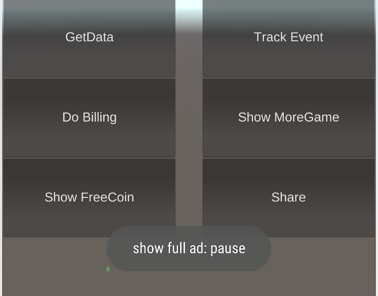

# RiseSDK for Unity3D

###### 1, Add dependencies
Copy the folder named Plugins into your Unity3D project Assets folder


###### 2, Initialize
Call the Init function in a gameObject's Awake function in your initialize scene
```js
void Awake() {
  RiseSdk.Instance.Init();
  // when you want to use IAP or reward ad
  // then you should define this function
  // see step 4 and 5
  InitListeners();
}
```

###### 3, ADs
* Call the functions in need
```js
// show start ad when you want
RiseSdk.Instance.ShowAd(RiseSdk.M_START);

// show pause ad when you want
RiseSdk.Instance.ShowAd(RiseSdk.M_PAUSE);

// show custom ad when you want
RiseSdk.Instance.ShowAd(RiseSdk.M_CUSTOM);

// show banner in the bottom center position of your phone
RiseSdk.Instance.ShowBanner(RiseSdk.POS_BANNER_MIDDLE_BOTTOM);

// close banner
RiseSdk.Instance.CloseBanner();

// exit game
RiseSdk.Instance.OnExit();

// ask the player to give your game a 5 stars rating
RiseSdk.Instance.Rate ();

// ask the player to share your game with his friends
RiseSdk.Instance.Share();

// show more game to the player
RiseSdk.Instance.ShowMore();

// track events
RiseSdk.Instance.TrackEvent ("your category", "your action", "your label", 1);

// get server data for your game if needed
string data = RiseSdk.Instance.GetExtraData ();
```

###### 4, In-App billing
* When you want to use google checkout, then you should do this:
```js
void InitListeners() {
  RiseSdkListener.OnPaymentEvent -= OnPaymentResult;
  RiseSdkListener.OnPaymentEvent += OnPaymentResult;
}

void OnPaymentResult(bool success, int billId) {
		if (success) {
			switch (billId) {
			case 1:// the first billing Id success
				break;
			case 2:// the second billing Id success
				break;
			}
			Debug.LogError("On billing success : " + billId);
		} else {
			Debug.LogError("On billing failure : " + billId);
		}
	}
```

* then call Pay function to launch payment flow
```js
RiseSdk.Instance.Pay(billId);
```

###### 5, Reward Ads
* when you want to use reward ad, then you should do:
```js
void InitListeners() {
  RiseSdkListener.OnRewardAdEvent -= GetFreeCoin;
  RiseSdkListener.OnRewardAdEvent += GetFreeCoin;
}

void GetFreeCoin (int rewardId){
  switch(rewardId) {
    case 1:
    // you can add random golds, eg. 10
    player.gold += 10;
    break;
  }
  Debug.LogError ("free coin: " + rewardId);
}
```
* and now you can call
```js
// show reward ad
RiseSdk.Instance.ShowRewardAd(rewardId);

// determine whether exists reward ad
bool yes = RiseSdk.Instance.HasRewardAd();
if (yes) {
  setRewardButtonEnable();
} else {
  setRewardButtonDisable();
}
...
```

###### 6, SNS
* When you want to use SNS, eg. facebook to login, you should do this:
```js
void InitListeners() {
  RiseSdkListener.OnSNSEvent -= OnSNSEvent;
  RiseSdkListener.OnSNSEvent += OnSNSEvent;
}

void OnSNSEvent(bool success, int eventType, int extra) {
		switch (eventType) {
		case RiseSdk.SNS_EVENT_LOGIN:
			Debug.LogError ("login: " + success);
			break;

		case RiseSdk.SNS_EVENT_INVITE:
			Debug.LogError ("invite: " + success);
			break;

		case RiseSdk.SNS_EVENT_LIKE:
			Debug.LogError ("like success? " + success);
			break;

		case RiseSdk.SNS_EVENT_CHALLENGE:
			int friendsCount = extra;
			Debug.LogError ("challenge: " + friendsCount);
			break;
		}
	}
```
* and then you can do this:
```js
// when you want to login
RiseSdk.Instance.Login();

// when you want to log out
RiseSdk.Instance.Logout();

// determine is login
RiseSdk.Instance.IsLogin();

// invite friends
RiseSdk.Instance.Invite ();

// like facebook page
RiseSdk.Instance.Like ();

// challenge your friends
RiseSdk.Instance.Challenge ("your see", "speed coming...");

// get self profile
string mestring = RiseSdk.Instance.Me ();
// friends is a Hashtable, {"id":"xxx", "name":"xxx", "picture":"/sdcard/.cache/xxxxx"}
object me = MiniJSON.jsonDecode (mestring);

// get friend list
string friendstring = RiseSdk.Instance.GetFriends ();
// friends is an ArrayList, [{"id":"xxx", "name":"xxxx", "picture":"/sdcard/.cache/xxxxx"}, ...]
object friends = MiniJSON.jsonDecode (friendstring);
```

###### 7, Leaderboard
When you want to use leaderboard, you should do this:
* Define leaderboard call back
```js
void InitListeners() {
  RiseSdkListener.OnLeaderBoardEvent -= OnLeaderBoardResult;
  RiseSdkListener.OnLeaderBoardEvent += OnLeaderBoardResult;
}

void OnLeaderBoardResult(bool submit, bool success, string leaderBoardId, string extraData) {
		if (submit) {
			if (success) {
				Debug.LogError ("submit to leader board success: " + leaderBoardId);
			} else {
				Debug.LogError ("submit to leader board failure: " + leaderBoardId);
			}
		} else {
			if (success) {
				Debug.LogError ("load leader board " + leaderBoardId + " success: " + extraData);
			} else {
				Debug.LogError ("load leader board failure " + leaderBoardId);
			}
		}
	}
```
* and you can use leaderboard now, do this:
```js
// submit score to the leaderboard named "endless", the extra data is your game data that you want to sumbit
RiseSdk.Instance.SubmitScore ("endless", 1234, "{userName: haha}");

// load first 32 records of the friends leaderboard
RiseSdk.Instance.LoadFriendLeaderBoard ("endless", 1, 32, "friend_1,friend_2");

// load first 32 records of the leaderboard for all player
RiseSdk.Instance.LoadGlobalLeaderBoard ("endless", 1, 32);
```

###### 8, Native Ads
When you want to show some ads in your loading stage or pause game stage, you can use this type of ad. This Ad will show in screen position that measured by percentage of the screen height that you want. see blow:
```js
// show native ad in screen with y position of 45 percent of screen height
RiseSdk.Instance.ShowNativeAd ("loading", 45);

// hide native ad
RiseSdk.Instance.HideNativeAd ("loading");

// check whether exists any native ad
if (RiseSdk.Instance.HasNativeAd ("loading")) {
  // show loading with native ad
} else {
  // show common loading
}
```

###### 9, Congratulations, done.
when you run your game in your android phone or emulator, your will see some toast information like this:
<center></center>
